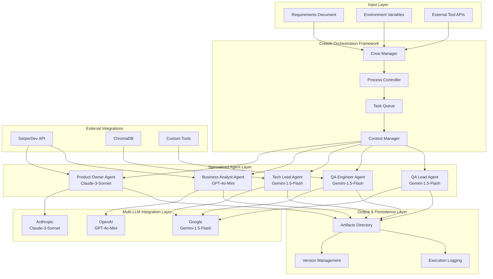

blockvoltcr7: explain to me how this works chat modes with .bmad-core

GitHub Copilot: I'll examine the .bmad-core folder and the chatmodes to explain how this system works. Based on my examination of the .bmad-core folder and the chatmodes, I can explain how this BMad (Business Modeling & Agile Development) system works:

## BMad Chat Modes System Overview

The BMad system is an **AI-powered development methodology** that uses specialized agent personas to guide different phases of software development. Here's how it works:

### 1. **Core Architecture**
- **.bmad-core** contains the complete methodology framework
- **chatmodes** contains agent activation files for GitHub Copilot Chat
- Each chatmode file activates a specific AI agent persona with specialized capabilities

### 2. **Agent System**
The system includes 10 specialized agents, each with specific roles:

- **📊 Analyst (Mary)** - Market research, brainstorming, competitive analysis
- **🏗️ Architect** - Technical architecture and system design  
- **💻 Developer (James)** - Code implementation and debugging
- **📋 Project Manager** - Project planning and coordination
- **👑 Product Owner** - Requirements management and story creation
- **🔍 QA (Quinn)** - Test strategy and quality assurance
- **🏃 Scrum Master** - Sprint management and story drafting
- **🎨 UX Expert** - User experience and frontend specifications
- **🧙 BMad Master** - Universal task executor across all domains
- **🎯 BMad Orchestrator** - Workflow coordination and agent management

### 3. **How Chat Modes Work**

When you activate a chatmode (e.g., `@dev` in GitHub Copilot Chat):

1. **Agent Activation**: The system loads the specific `.chatmode.md` file
2. **Persona Adoption**: The AI adopts the agent's personality, expertise, and behavioral patterns
3. **Context Loading**: Reads the project configuration from core-config.yaml
4. **Command System**: Each agent has specific commands (prefixed with `*`) like:
   - `*help` - Shows available commands
   - `*draft` - Creates new stories (SM agent)  
   - `*develop-story` - Implements features (Dev agent)
   - `*risk` - Risk assessment (QA agent)

### 4. **Development Workflow**

The system follows a structured workflow:

**Planning Phase** (Web UI recommended for cost efficiency):
```
Analyst Research → Project Brief → PRD Creation → Architecture Design → Ready for Development
```

**Development Phase** (IDE-based):
```
Story Creation (SM) → Story Implementation (Dev) → QA Review → Deployment
```

### 5. **Key Features**

- **Document Management**: Automatic creation and organization of PRDs, architecture docs, stories
- **Quality Gates**: Built-in QA assessments and test design
- **Template System**: Standardized templates for all deliverables
- **Task Automation**: Predefined workflows for common development tasks
- **Knowledge Base**: Centralized project knowledge and technical preferences

### 6. **File Structure**
```
.bmad-core/
├── agents/          # Agent definitions
├── tasks/           # Executable workflows  
├── templates/       # Document templates
├── checklists/      # Quality checklists
├── data/           # Knowledge base
└── workflows/      # Process definitions
```

This system transforms your IDE into an **AI-powered development environment** where different specialized agents guide you through each phase of software development, ensuring consistency, quality, and adherence to best practices.

blockvoltcr7: activate  architect mode

GitHub Copilot: I'll activate architect mode for you. Let me load the architect agent persona and configuration. 🏗️ **Hello! I'm Winston, your Holistic System Architect & Full-Stack Technical Leader.**

I specialize in complete systems architecture, cross-stack optimization, and pragmatic technology selection. I approach every design challenge by viewing components as part of a larger system, starting with user journeys and working backward to create comprehensive, scalable solutions.

**Project Configuration Loaded:**
- Architecture Version: v4
- Architecture File: `docs/architecture.md` 
- Architecture Sharded: Yes → `docs/architecture/`
- Dev Load Files: coding-standards.md, tech-stack.md, source-tree.md

---

## Available Commands

Please select a command by typing its number or name:

1. **create-backend-architecture** - Create backend system architecture
2. **create-brownfield-architecture** - Create architecture for existing systems
3. **create-front-end-architecture** - Create frontend architecture specification
4. **create-full-stack-architecture** - Create comprehensive full-stack architecture
5. **doc-out** - Output full document to current destination file
6. **document-project** - Document existing project architecture
7. **execute-checklist** - Run architect quality checklist
8. **research** - Create deep research prompt on architectural topics
9. **shard-prd** - Shard the architecture document for development
10. **yolo** - Toggle Yolo Mode for rapid prototyping
11. **exit** - Exit architect mode

---

I'm ready to help you design robust, scalable systems that balance technical excellence with pragmatic constraints. What architectural challenge shall we tackle today?


blockvoltcr7: 
create-backend-architecture (social-media-mgmt folder as context)


GitHub Copilot:
I'll create a backend architecture document for the CrewAI system. Let me access the appropriate template and generate the architecture. Now I'll initiate the backend architecture creation process using the template system. Let me start by reading the PRD to gather context for the architecture. Based on my analysis, I can see we're working with a CrewAI system but I don't see a specific PRD document in the standard location. Let me proceed with creating the backend architecture for the CrewAI multi-agent system using the available context from the system exploration.

## 🏗️ **Backend Architecture Creation Process**

I notice there's no `docs/prd.md` file available to serve as the basis for the architecture. This is perfectly fine - I can work with the comprehensive understanding I've gained from analyzing your CrewAI system.

**Current Context:**
- **System:** Multi-Agent AI Orchestration Framework (CrewAI)
- **Primary Use Case:** ESG Financial Reporting Automation  
- **Secondary Use Case:** Social Media Management Automation
- **Architecture Mode:** Interactive elicitation enabled

---

### **Starter Template Assessment**

Before proceeding with architecture design, let me check for any existing foundation:

**Analysis:** Based on the CrewAI system structure, this appears to be built on:
- **CrewAI Framework** - Multi-agent orchestration platform
- **LangChain Community** - LLM integration layer
- **Python Ecosystem** - Core runtime environment

**Current Implementation:**
- Existing Python-based multi-agent system
- Multiple LLM provider integrations (OpenAI, Google, Anthropic)
- File-based artifact management
- Extensible tool framework

**Decision:** N/A - This is an existing system requiring architectural documentation rather than new template selection.

---

### **Change Log**

| Date | Version | Description | Author |
|------|---------|-------------|---------|
| 2025-09-05 | 1.0 | Initial backend architecture documentation | Winston (Architect) |

---

## **High Level Architecture**

### **Technical Summary**

The CrewAI system implements a **multi-agent orchestration architecture** leveraging sequential task processing across specialized AI agents. The system integrates multiple LLM providers (OpenAI GPT-4, Google Gemini, Anthropic Claude) through a unified CrewAI framework to automate complex software development lifecycle processes. Core architectural patterns include agent specialization, task dependency management, and file-based artifact persistence, supporting both financial compliance automation and social media content generation workflows.

### **High Level Overview**

**1. Architectural Style:** Multi-Agent Sequential Processing Architecture
- **Pattern:** Specialized agent personas with sequential task execution
- **Coordination:** CrewAI framework managing agent interactions and task dependencies
- **Processing Model:** Linear workflow with context propagation between agents

**2. Repository Structure:** Monorepo with feature-based organization
- **Core System:** Single repository containing all agent implementations
- **Use Case Separation:** Distinct directories for different automation domains
- **Experimental Features:** Dedicated testing and learning directories

**3. Service Architecture:** Framework-based agent orchestration  
- **Agent Layer:** Specialized AI personas with distinct responsibilities
- **Integration Layer:** Multi-LLM provider abstraction
- **Output Layer:** Structured artifact generation and storage

**4. Primary Data Flow:**
```
Requirements Input → Agent Task Queue → Sequential Processing → Multi-LLM Execution → Artifact Generation → File Storage
```

**5. Key Architectural Decisions:**
- **Multi-LLM Strategy:** Strategic model assignment based on agent expertise areas
- **Sequential Processing:** Ensures context continuity and dependency satisfaction
- **File-Based Persistence:** Markdown artifacts for human readability and version control
- **Tool Extensibility:** Plugin-based architecture for custom capabilities

### **High Level Project Diagram**



### **Architectural and Design Patterns**

I'll present the key architectural patterns with options and recommendations:

**1. Multi-Agent Orchestration Pattern**
- **Option A:** Hierarchical Agent Management (Manager-Subordinate)
- **Option B:** Sequential Agent Processing (Current Implementation) 
- **Option C:** Parallel Agent Execution with Synchronization

**Recommendation:** Sequential Agent Processing - _Rationale:_ Ensures context continuity, simplifies dependency management, and aligns with document generation workflow requirements

**2. LLM Integration Strategy**
- **Option A:** Single LLM Provider (Vendor Lock-in)
- **Option B:** Multi-LLM Strategic Assignment (Current Implementation)
- **Option C:** Dynamic LLM Selection Based on Task Complexity

**Recommendation:** Multi-LLM Strategic Assignment - _Rationale:_ Leverages each model's strengths, provides vendor flexibility, and optimizes cost through strategic model selection

**3. State Management Pattern**  
- **Option A:** Database-Backed State Persistence
- **Option B:** File-Based Artifact Storage (Current Implementation)
- **Option C:** In-Memory State with Checkpointing

**Recommendation:** File-Based Artifact Storage - _Rationale:_ Provides human-readable outputs, enables version control integration, and supports audit trail requirements

---

**Ready to proceed with detailed technical specifications?**

Please select your preferred approach:

1. **Proceed to next section** (Tech Stack definition)
2. **Deep dive into agent specialization patterns** - Explore different agent coordination strategies
3. **Analyze alternative architectural styles** - Compare microservices vs current monolithic approach  
4. **Investigate scalability implications** - Examine horizontal scaling options
5. **Review security architecture** - Focus on API key management and data protection
6. **Explore integration patterns** - External service integration strategies
7. **Discuss deployment architectures** - Container orchestration vs serverless options
8. **Examine monitoring strategies** - Observability and performance tracking approaches
9. **Custom question or feedback** - Ask about specific architectural concerns

Select 1-9 or just type your question/feedback: